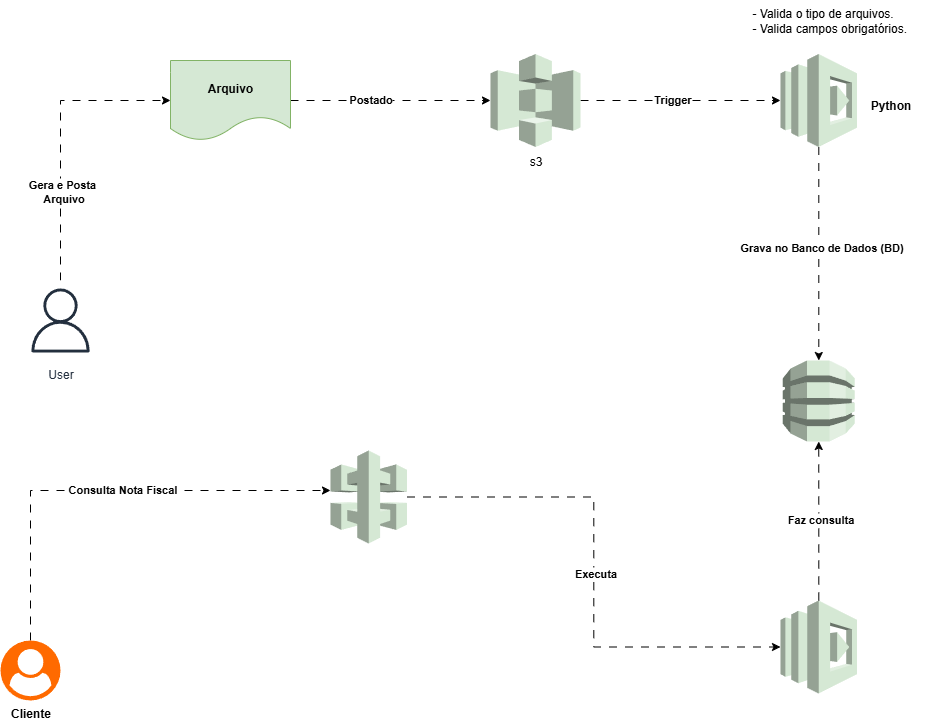

# Projeto LocalStack – Processamento de Notas Fiscais

## 🧾 Descrição do Projeto:

Este projeto tem como objetivo simular uma arquitetura serverless de forma local, utilizando o LocalStack para emular os principais serviços da AWS, como: S3, Lambda e DynamoDB.

Inspirado no tema “Executando Tarefas Automatizadas com Lambda Function e S3”, apresentado durante as aulas, o projeto demonstra como é possível automatizar o processamento de dados por meio da integração entre esses serviços.

A iniciativa faz parte do Desafio do Módulo 11 – Automação de Tarefas com DevOps na AWS, e visa demonstrar, de maneira prática, como reproduzir o funcionamento de aplicações em nuvem AWS em ambiente local — proporcionando aprendizado e experimentação sem custos de infraestrutura.

A aplicação processa arquivos de **notas fiscais**, que são enviados para um bucket S3.  
Quando um arquivo é postado, o serviço **Lambda** é acionado automaticamente para validar e gravar as informações no banco de dados **DynamoDB**.

# Objetivo:

Automatizar o fluxo de **upload e processamento de notas fiscais**, integrando os serviços:

- **Amazon S3** → armazenamento de arquivos JSON.
- **AWS Lambda** → processamento automático dos dados. 
- **Amazon DynamoDB** → persistência das informações processadas.  

Tudo executado localmente com **LocalStack**, sem custos e com comportamento idêntico ao ambiente AWS real.

## Arquitetura do Projeto:

A imagem abaixo representa o fluxo completo da aplicação:

**Fluxo resumido:**

1. O usuário gera um arquivo JSON de notas fiscais com o script gerar_dados.py;

2. O arquivo é enviado ao bucket S3 (notas-fiscais-upload);

3. O S3 dispara um evento que aciona a função Lambda (ProcessarNotasFiscais);

4. A função Lambda (grava_db.py) valida e grava as informações no DynamoDB (NotasFiscais);

5. As informações podem ser consultadas no NoSQL Workbench ou via linha de comando.

## Tecnologias Utilizadas:

- **Python 3.9**
- **AWS CLI**
- **LocalStack**
- **DynamoDB Local**
- **S3 (emulado pelo LocalStack)**
- **Lambda (emulado pelo LocalStack)**
- **Git e GitHub**
- **NoSQL Workbench**
- **Draw.io** para criação do diagrama de arquitetura
- **Postman**

## Etapas de Implementação:

### 1️⃣ Geração do arquivo de notas fiscais:

O script gerar_dados.py foi criado para gerar automaticamente um arquivo de teste chamado notas_fiscais_2025.json.

python gerar_dados.py

Saída esperada:

✅ Arquivo 'notas_fiscais_2025.json' gerado com sucesso!

### 2️⃣ Criação da Função Lambda
**Arquivo principal:** grava_db.py

import json
import boto3

def lambda_handler(event, context):
    dynamodb = boto3.resource('dynamodb', endpoint_url='http://localhost:4566')
    table = dynamodb.Table('NotasFiscais')

    for record in event['Records']:
        body = json.loads(record['body']) if 'body' in record else {}
        id_nf = body.get('id', 'NF-desconhecida')
        cliente = body.get('cliente', 'Desconhecido')
        valor = body.get('valor', 0)
        data_emissao = body.get('data_emissao', 'N/A')

        table.put_item(Item={
            'id': id_nf,
            'cliente': cliente,
            'valor': valor,
            'data_emissao': data_emissao
        })

    return {
        'statusCode': 200,
        'body': json.dumps('Nota fiscal gravada com sucesso!')
    }

**Compactação da função:**

zip lambda_function.zip grava_db.py

### 3️⃣ Criação da função no LocalStack:

aws lambda create-function \
--function-name ProcessarNotasFiscais \
--runtime python3.9 \
--role arn:aws:iam::000000000000:role/lambda-role \
--handler grava_db.lambda_handler \
--zip-file fileb://lambda_function.zip \
--endpoint-url=http://localhost:4566

### 4️⃣ Criação da tabela no DynamoDB:

aws dynamodb create-table \
--table-name NotasFiscais \
--attribute-definitions AttributeName=id,AttributeType=S \
--key-schema AttributeName=id,KeyType=HASH \
--provisioned-throughput ReadCapacityUnits=5,WriteCapacityUnits=5 \
--endpoint-url=http://localhost:4566

### 5️⃣ Criação do bucket S3:

aws s3api create-bucket \
--bucket notas-fiscais-upload \
--endpoint-url=http://localhost:4566

### 6️⃣ Configuração da notificação S3 → Lambda:

aws s3api put-bucket-notification-configuration \
--bucket notas-fiscais-upload \
--notification-configuration file://notification_roles.json \
--endpoint-url=http://localhost:4566

### 7️⃣ Envio do arquivo JSON ao bucket:

aws s3 cp notas_fiscais_2025.json s3://notas-fiscais-upload/ --endpoint-url=http://localhost:4566

## Validação dos Dados:

Os dados podem ser visualizados através do NoSQL Workbench, conectando ao endpoint local (http://localhost:4566).
A tabela NotasFiscais mostrará os registros inseridos automaticamente pela Lambda.

## Testes e Depuração:

Durante a execução, foram realizados diversos testes e correções, incluindo:

- Criação e atualização de funções Lambda via AWS CLI;

- Validação de logs e erros (FunctionError: Unhandled, ImportModuleError);

- Correção de empacotamento (lambda_function.zip contendo o arquivo correto);

- Testes de integração entre S3 → Lambda → DynamoDB;

- Verificação com aws logs tail e ajustes de configuração.

## Futuro: Integração com o Postman

O Postman será utilizado futuramente para testar endpoints HTTP de forma simulada, caso seja implementada uma API Gateway local.
Essa integração permitirá enviar notas fiscais e acompanhar o fluxo completo da aplicação via requisições REST.

## Estrutura do Projeto:

projeto-localstack/
│
├── grava_db.py
├── gerar_dados.py
├── lambda_function.zip
├── notas_fiscais.json
├── notas_fiscais_2025.json
├── notification_roles.json
├── README.md
├── diagrama_localstack.drawio
└── diagrama_localstack.png

## Conclusão:

Com este projeto, foi possível compreender na prática o funcionamento dos principais serviços da AWS e observar como eles se integram por meio de **eventos automatizados.**
O uso do **LocalStack** tornou o processo de aprendizado mais acessível, permitindo testar e simular ambientes reais da AWS sem custos ou dependência de conexão com a nuvem.
O desafio foi fundamental para consolidar os conhecimentos sobre automação, funções Lambda e persistência de dados com DynamoDB — aplicando tudo em um ambiente local e controlado.
O projeto foi concluído com sucesso, com o LocalStack devidamente configurado, os serviços AWS emulados e a automação funcionando de ponta a ponta — integrando S3, Lambda e DynamoDB para o processamento eficiente de notas fiscais.

## Conceitos aplicados:

Arquitetura serverless

Eventos do S3

Funções Lambda

Persistência no DynamoDB

Integração local com AWS CLI

## Lições Aprendidas:

Durante o desenvolvimento, enfrentei diversos desafios técnicos que me ajudaram a entender melhor o funcionamento real dos serviços AWS.
Essas foram algumas das principais lições aprendidas:

- **Ordem de criação dos serviços importa:** criar a função Lambda antes de configurar a notificação S3 → Lambda evita erros de validação.

**Empacotamento correto da função Lambda:** o erro Unable to import module 'lambda_function' ensinou a garantir que o nome do arquivo e o handler coincidam.

**Uso correto do endpoint local:** sempre utilizar --endpoint-url=http://localhost:4566 para garantir que a execução ocorra no LocalStack.

**Validação do S3 e DynamoDB com CLI:** comandos aws s3 ls e aws dynamodb scan foram essenciais para verificar os resultados.

**Erros são parte do processo:** cada falha trouxe mais clareza sobre como a AWS realmente funciona por trás dos bastidores.

**Importância da depuração:** entender mensagens como FunctionError: Unhandled e ResourceNotFoundException foi essencial para ajustar a função e os papéis de permissão.

Essas dificuldades transformaram o aprendizado em prática real, mostrando que compreender os erros é tão importante quanto ver o código funcionando.

### ✨ Autora: 
**Bianca Curcino**
Projeto desenvolvido como parte prática de estudos sobre AWS e LocalStack e automação com DevOps.# Desafio-AWS-Executando-Tarefas-Automatizadas-

